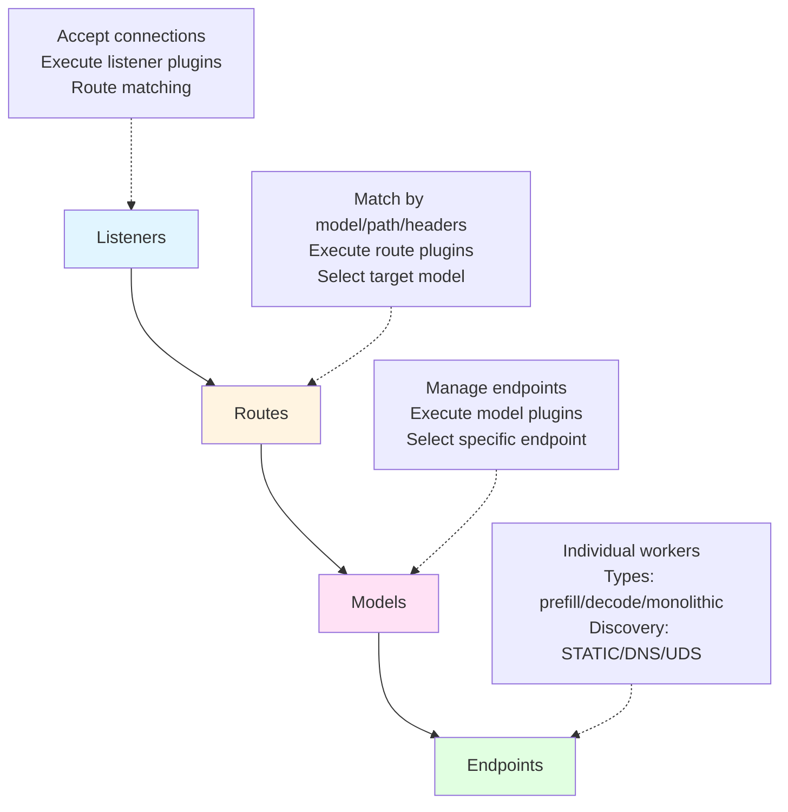
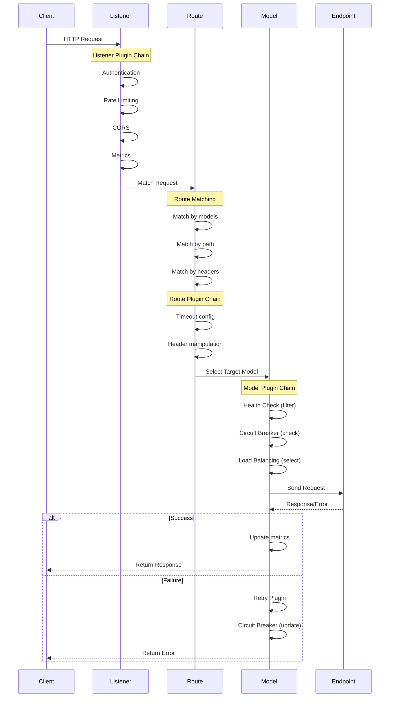
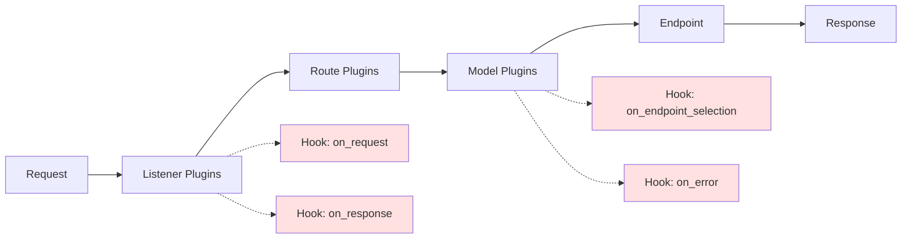
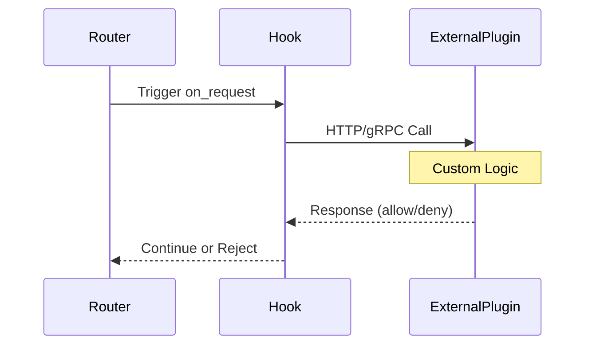

# vLLM Router Core Architecture Refactoring

**Version**: 1.0
**Date**: 2025-12-15
**Status**: Design Phase

---

## Table of Contents

1. [Background](#1-background)
2. [Problems with Current Design](#2-problems-with-current-design)
3. [Goals](#3-goals)
4. [Core Design Principles](#4-core-design-principles)
5. [Architecture Overview](#5-architecture-overview)
6. [Detailed Design](#6-detailed-design)
7. [Configuration Examples](#7-configuration-examples)
8. [References](#8-references)

---

## 1. Background

### 1.1 Current State

vLLM Router is a high-performance routing layer for Large Language Model (LLM) inference services. It currently supports:
- Load balancing across multiple vLLM workers
- Prefill-Decode disaggregation
- Multiple routing policies (cache-aware, round-robin, power-of-two, etc.)
- Health checking and circuit breaking
- Kubernetes service discovery

### 1.2 Motivation for Refactoring

The current implementation has grown organically and lacks a clear architectural foundation. As we add more features (multi-model support, advanced routing, dynamic configuration), the limitations of the current design become apparent.

This refactoring aims to establish a solid architectural foundation based on proven proxy design patterns, enabling:
- Clear separation of concerns
- Extensibility through plugin architecture
- Support for complex multi-model scenarios
- Foundation for future dynamic configuration capabilities

---

## 2. Problems with Current Design

### 2.1 Lack of Core Abstractions

**Problem**: The current design doesn't have clear separation between:
- Listeners (where requests arrive)
- Routes (how requests are matched and routed)
- Models (upstream service clusters)
- Endpoints (individual worker instances)

**Impact**:
- Cannot support multiple listeners on different ports
- Cannot route different models to different backend clusters
- Configuration is flat and inflexible

### 2.2 No Plugin Chain Architecture

**Problem**: Capabilities like load balancing, retry, circuit breaking, and health checking are implemented as global, monolithic components rather than composable plugins.

**Impact**:
- Cannot configure different policies for different models
- Cannot easily add new capabilities
- Tight coupling between components

### 2.3 Inconsistent Configuration

**Problem**: Multiple configuration systems coexist:
- CLI arguments
- YAML configuration files (`config/router.yaml`)
- Old JSON configuration (`examples/configs/*.json`)
- These systems are incompatible and confusing

**Impact**:
- Poor user experience
- Difficult to maintain
- Cannot support advanced use cases

### 2.4 Limited Multi-Model Support

**Problem**: The current design assumes a single model or a simple prefill-decode split. There's no way to:
- Route different model names to different backend clusters
- Configure per-model policies
- Support multiple models with different characteristics

**Impact**:
- Cannot serve multiple models from one router instance
- Users need to deploy multiple routers for multi-model scenarios

---

## 3. Goals

### 3.1 Primary Goals

1. **Align with Envoy's Architecture**: Adopt Envoy's four-layer model (Listeners, Routes, Clusters/Models, Endpoints)
2. **Plugin Chain System**: Implement a flexible plugin architecture for extensibility
3. **Multi-Model Support**: Enable routing multiple models with independent configurations
4. **Unified Configuration**: Single, clear YAML-based configuration system
5. **Backward Compatibility**: Maintain CLI compatibility where possible

### 3.2 Future Goals (Out of Scope for Phase 1)

1. **Dynamic Configuration Reload**: Hot-reload configuration without restart
2. **gRPC Control Plane**: xDS-like protocol for dynamic service discovery
3. **Advanced Observability**: Distributed tracing, detailed metrics
4. **Multi-Protocol Support**: HTTP/2, gRPC, WebSocket

---

## 4. Core Design Principles

### 4.1 Separation of Concerns

Each layer has a clear responsibility:
- **Listeners**: Accept connections, handle protocol-level concerns
- **Routes**: Match requests to target models
- **Models**: Manage upstream service clusters
- **Endpoints**: Represent individual worker instances

### 4.2 Plugin-Based Extensibility

Capabilities are implemented as plugins that can be:
- Configured at different layers (listener, route, model)
- Composed and chained together
- Enabled/disabled independently
- Extended by users

### 4.3 Configuration-Driven

All behavior is controlled through declarative YAML configuration:
- Easy to understand and version control
- Supports complex scenarios without code changes
- Clear defaults for simple use cases

### 4.4 Progressive Disclosure

Simple use cases should have simple configurations. Advanced features are opt-in:
- Minimal configuration for single-model scenarios
- Rich configuration options for complex deployments

---

## 5. Architecture Overview

### 5.1 Four-Layer Model



### 5.2 Request Processing Flow



### 5.3 Plugin Chain Architecture

Plugins are executed at different layers with specific responsibilities:

**Listener Plugins** (Request/Response Level):
- Authentication: Verify API keys, tokens
- Rate Limiting: Global request rate control
- CORS: Cross-origin resource sharing
- Request ID: Generate and propagate request IDs
- Metrics: Record request/response metrics

**Route Plugins** (Routing Level):
- Timeout: Configure request timeouts
- Header Manipulation: Add/remove/modify headers
- Request Transformation: Modify request body

**Model Plugins** (Upstream Level):
- Load Balancing: Select endpoint (cache-aware, round-robin, etc.)
- Health Check: Monitor endpoint health
- Circuit Breaker: Prevent cascading failures
- Retry: Retry failed requests
- Outlier Detection: Detect and eject unhealthy endpoints
- Connection Pool: Manage connections to endpoints

## 6. Detailed Design

### 6.1 Listeners

**Purpose**: Accept incoming connections and handle protocol-level concerns.

**Configuration Schema**:
```yaml
listeners:
  - name: "main_listener"
    address: "0.0.0.0:8000"      # Bind address
    protocol: "http"              # http, grpc

    # Listener-level plugins
    plugins:
      - type: "authentication"
        config:
          api_key: "${API_KEY}"   # Environment variable support

      - type: "rate_limit"
        config:
          requests_per_second: 1000
          burst_size: 100

      - type: "cors"
        config:
          allowed_origins: ["*"]
          allowed_methods: ["GET", "POST"]

      - type: "metrics"
        config:
          enabled: true
          port: 9000

    # Routes embedded in listener
    routes:
      - name: "llama_models"
        match:
          models: ["llama-3-70b", "llama-3-8b"]  # Multiple model names
          path: "/v1/chat/completions"
          headers:
            - name: "X-Model-Type"
              value: "llama"
        target_model: "llama_cluster"
```

**Key Features**:
- Multiple listeners on different ports
- Protocol-specific handling (HTTP, gRPC)
- Plugin chain for cross-cutting concerns
- Routes embedded for simplicity

### 6.2 Routes and Matching

**Purpose**: Match incoming requests to target models based on various criteria.

**Matching Rules**:

1. **Model Name Matching** (slice):
   ```yaml
   match:
     models: ["llama-3-70b", "llama-3-8b", "llama-2-70b"]
   ```
   - Matches if request's model name is in the list
   - Extracted from request body or headers

2. **Path Matching**:
   ```yaml
   match:
     path: "/v1/chat/completions"  # Exact match
     # OR
     path_prefix: "/v1/"            # Prefix match
   ```

3. **Header Matching**:
   ```yaml
   match:
     headers:
       - name: "X-Model-Type"
         value: "llama"              # Exact match
       - name: "X-Priority"
         regex: "high|critical"      # Regex match
   ```

4. **Combined Matching** (AND logic):
   ```yaml
   match:
     models: ["llama-3-70b"]
     path: "/v1/chat/completions"
     headers:
       - name: "X-Tenant"
         value: "premium"
   ```

**Route Selection**:
- Routes are evaluated in order
- First matching route is selected
- If no route matches, return 404

**Route Plugins**:
```yaml
routes:
  - name: "premium_route"
    match:
      models: ["llama-3-70b"]
    target_model: "llama_70b_cluster"
    plugins:
      - type: "timeout"
        config:
          request_timeout_secs: 600  # Longer timeout for premium

      - type: "header_manipulation"
        config:
          add:
            - name: "X-Route"
              value: "premium"
```

### 6.3 Models

**Purpose**: Represent upstream service clusters with independent configurations.

**Model Types**:

1. **Monolithic** (formerly "regular"):
   ```yaml
   models:
     - name: "llama_8b_cluster"
       type: "monolithic"
       endpoints: "llama_8b_workers"
   ```
   - Single-stage inference
   - All endpoints are equivalent

2. **Prefill-Decode**:
   ```yaml
   models:
     - name: "llama_70b_pd"
       type: "prefill_decode"
       endpoints: "llama_70b_workers"
   ```
   - Manual prefill-decode disaggregation
   - Endpoints have types: "prefill" or "decode"
   - Router manages the two-stage flow

3. **vLLM Prefill-Decode**:
   ```yaml
   models:
     - name: "llama_70b_vllm_pd"
       type: "vllm_prefill_decode"
       endpoints: "llama_70b_workers"
   ```
   - vLLM native prefill-decode mode
   - Uses vLLM's built-in disaggregation protocol
   - Endpoints have types: "prefill" or "decode"

**Model Plugins**:
```yaml
models:
  - name: "llama_70b_pd"
    type: "prefill_decode"
    endpoints: "llama_70b_workers"

    plugins:
      # Load Balancing
      - type: "load_balancing"
        config:
          prefill_policy: "cache_aware"
          prefill_config:
            cache_threshold: 0.3
            balance_abs_threshold: 64
          decode_policy: "power_of_two"
          decode_config:
            load_check_interval_secs: 5

      # Health Check
      - type: "health_check"
        config:
          interval_secs: 60
          timeout_secs: 5
          failure_threshold: 3
          success_threshold: 2
          path: "/health"

      # Circuit Breaker
      - type: "circuit_breaker"
        config:
          failure_threshold: 10
          timeout_duration_secs: 60
          half_open_requests: 3

      # Retry
      - type: "retry"
        config:
          max_retries: 3
          initial_backoff_ms: 50
          max_backoff_ms: 1000
          backoff_multiplier: 2.0
          retry_on:
            - "connection_error"
            - "timeout"
            - "5xx"
```

### 6.4 Endpoints

**Purpose**: Represent individual worker instances with discovery and health management.

**Endpoint Types**:
- `prefill`: Prefill-only worker (for disaggregated models)
- `decode`: Decode-only worker (for disaggregated models)
- `monolithic`: Full inference worker (for monolithic models)

**Discovery Types**:

1. **STATIC**: Manually configured endpoints
   ```yaml
   endpoints:
     - name: "llama_workers"
       discovery_type: "STATIC"
       addresses:
         - url: "http://worker1:8000"
           type: "monolithic"
         - url: "http://worker2:8000"
           type: "monolithic"
   ```

2. **DNS**: DNS-based discovery
   ```yaml
   endpoints:
     - name: "llama_workers"
       discovery_type: "DNS"
       dns_config:
         hostname: "llama-workers.default.svc.cluster.local"
         port: 8000
         refresh_interval_secs: 60
       endpoint_type: "monolithic"  # All resolved endpoints have this type
   ```

3. **UDS** (Unix Domain Socket): Local socket communication
   ```yaml
   endpoints:
     - name: "local_workers"
       discovery_type: "UDS"
       uds_config:
         socket_path: "/var/run/vllm/worker.sock"
       endpoint_type: "monolithic"
   ```

**Prefill-Decode Endpoints**:
```yaml
endpoints:
  - name: "llama_70b_workers"
    discovery_type: "STATIC"
    addresses:
      # Prefill workers
      - url: "http://prefill1:8000"
        type: "prefill"
        metadata:
          bootstrap_port: 8001  # For vLLM PD
          zone: "us-west-1a"

      - url: "http://prefill2:8000"
        type: "prefill"
        metadata:
          bootstrap_port: 8001
          zone: "us-west-1b"

      # Decode workers
      - url: "http://decode1:8000"
        type: "decode"
        metadata:
          zone: "us-west-1a"

      - url: "http://decode2:8000"
        type: "decode"
        metadata:
          zone: "us-west-1b"
```

**Endpoint Metadata**:
- Arbitrary key-value pairs
- Used by plugins (e.g., zone-aware routing)
- Preserved during discovery

### 6.5 Plugin System

The plugin system provides extensibility at multiple levels with support for both built-in and external plugins.

#### 6.5.1 Plugin Architecture



#### 6.5.2 Plugin Types

**Built-in Plugins**: Compiled into the router binary
- High performance (no external call overhead)
- Direct access to internal state
- Examples: LoadBalancingPlugin, HealthCheckPlugin, CircuitBreakerPlugin

**External Plugins**: Called via external interface
- Flexible deployment (can be updated independently)
- Language-agnostic (HTTP/gRPC interface)
- Examples: Custom authentication, custom transformation logic

#### 6.5.3 Plugin Trait Hierarchy

```rust
/// Base plugin trait
pub trait Plugin: Send + Sync {
    fn name(&self) -> &str;
    fn enabled(&self) -> bool { true }
}

/// Listener-level plugin
pub trait ListenerPlugin: Plugin {
    /// Called when a request is received
    fn on_request(&self, ctx: &mut RequestContext) -> Result<(), PluginError>;

    /// Called when a response is sent
    fn on_response(&self, ctx: &mut ResponseContext) -> Result<(), PluginError>;
}

/// Route-level plugin
pub trait RoutePlugin: Plugin {
    /// Called after route matching
    fn on_route_matched(&self, ctx: &mut RouteContext) -> Result<(), PluginError>;
}

/// Model-level plugin
pub trait ModelPlugin: Plugin {
    /// Called before endpoint selection
    fn on_endpoint_selection(
        &self,
        ctx: &mut ModelContext
    ) -> Result<Vec<EndpointRef>, PluginError>;

    /// Called before sending request
    fn on_request_send(&self, ctx: &mut RequestContext) -> Result<(), PluginError>;

    /// Called after receiving response
    fn on_response_received(
        &self,
        ctx: &mut ResponseContext
    ) -> Result<(), PluginError>;

    /// Called on error
    fn on_error(&self, ctx: &mut ErrorContext) -> Result<RetryDecision, PluginError>;
}
```

#### 6.5.4 Hook System for External Plugins

The router provides hooks at key points in the request/response path for external plugins:

**Request Path Hooks**:
- `on_request`: After request is received, before routing
- `on_route_matched`: After route is matched, before model selection
- `on_endpoint_selection`: Before selecting specific endpoint
- `on_request_send`: Before sending request to endpoint

**Response Path Hooks**:
- `on_response_received`: After receiving response from endpoint
- `on_response`: Before sending response to client
- `on_error`: When an error occurs

**External Plugin Interface**:
```yaml
plugins:
  - type: "custom_auth"
    plugin_type: "external"  # built_in or external
    external_config:
      protocol: "http"  # http or grpc
      endpoint: "http://auth-service:8080/validate"
      timeout_ms: 100
    hooks:
      - "on_request"
```

**External Plugin Call Flow**:


#### 6.5.5 Core Plugin Implementations

| Plugin | Layer | Type | Purpose |
|--------|-------|------|---------|
| AuthenticationPlugin | Listener | Built-in/External | Verify API keys, tokens |
| RateLimitPlugin | Listener | Built-in | Global request rate control |
| CorsPlugin | Listener | Built-in | Cross-origin resource sharing |
| RequestIdPlugin | Listener | Built-in | Generate request IDs |
| MetricsPlugin | Listener/Model | Built-in | Record metrics |
| TimeoutPlugin | Route/Model | Built-in | Configure timeouts |
| HeaderManipulationPlugin | Route | Built-in/External | Modify headers |
| LoadBalancingPlugin | Model | Built-in | Select endpoint |
| HealthCheckPlugin | Model | Built-in | Monitor health |
| CircuitBreakerPlugin | Model | Built-in | Prevent failures |
| RetryPlugin | Model | Built-in | Retry failed requests |
| OutlierDetectionPlugin | Model | Built-in | Detect unhealthy endpoints |

#### 6.5.6 Plugin Configuration

**Built-in Plugin**:
```yaml
plugins:
  - type: "load_balancing"
    plugin_type: "built_in"
    enabled: true
    config:
      policy: "cache_aware"
      cache_threshold: 0.3
```

**External Plugin**:
```yaml
plugins:
  - type: "custom_transformer"
    plugin_type: "external"
    enabled: true
    external_config:
      protocol: "grpc"
      endpoint: "transformer-service:9090"
      timeout_ms: 200
    hooks:
      - "on_request"
      - "on_response"
    config:
      # Plugin-specific configuration passed to external service
      transformation_rules:
        - field: "prompt"
          action: "sanitize"
```

**Plugin Execution Order**:
- Plugins execute in the order they are defined
- Earlier plugins can modify context for later plugins
- Plugins can short-circuit the chain (e.g., auth failure)
- External plugins add latency; use sparingly on hot path

---

## 7. Configuration Examples

### 8.1 Minimal Configuration (Single Model)

```yaml
listeners:
  - name: "main"
    address: "0.0.0.0:8000"
    routes:
      - match:
          prefix: "/"
        target_model: "my_model"

endpoints:
  - name: "my_workers"
    discovery_type: "STATIC"
    addresses:
      - url: "http://worker1:8000"
      - url: "http://worker2:8000"

models:
  - name: "my_model"
    type: "monolithic"
    endpoints: "my_workers"
```

### 8.2 Multi-Model Configuration

```yaml
listeners:
  - name: "main"
    address: "0.0.0.0:8000"
    plugins:
      - type: "authentication"
        config:
          api_key: "${VLLM_API_KEY}"
      - type: "metrics"
        config:
          port: 9000

    routes:
      # Route for Llama models
      - name: "llama_route"
        match:
          models: ["llama-3-70b", "llama-3-8b", "llama-2-70b"]
          path: "/v1/chat/completions"
        target_model: "llama_cluster"

      # Route for Mistral models
      - name: "mistral_route"
        match:
          models: ["mistral-7b", "mistral-8x7b"]
        target_model: "mistral_cluster"

      # Default route
      - name: "default"
        match:
          prefix: "/"
        target_model: "default_cluster"

endpoints:
  - name: "llama_workers"
    discovery_type: "STATIC"
    addresses:
      - url: "http://llama-worker1:8000"
      - url: "http://llama-worker2:8000"

  - name: "mistral_workers"
    discovery_type: "STATIC"
    addresses:
      - url: "http://mistral-worker1:8000"

models:
  - name: "llama_cluster"
    type: "monolithic"
    endpoints: "llama_workers"
    plugins:
      - type: "load_balancing"
        config:
          policy: "cache_aware"

  - name: "mistral_cluster"
    type: "monolithic"
    endpoints: "mistral_workers"
    plugins:
      - type: "load_balancing"
        config:
          policy: "round_robin"

  - name: "default_cluster"
    type: "monolithic"
    endpoints: "llama_workers"
```

### 8.3 Prefill-Decode Configuration

```yaml
listeners:
  - name: "main"
    address: "0.0.0.0:8000"
    routes:
      - match:
          models: ["llama-3-70b"]
        target_model: "llama_70b_pd"

endpoints:
  - name: "llama_70b_workers"
    discovery_type: "STATIC"
    addresses:
      # Prefill workers
      - url: "http://prefill1:8000"
        type: "prefill"
      - url: "http://prefill2:8000"
        type: "prefill"

      # Decode workers
      - url: "http://decode1:8000"
        type: "decode"
      - url: "http://decode2:8000"
        type: "decode"
      - url: "http://decode3:8000"
        type: "decode"

models:
  - name: "llama_70b_pd"
    type: "prefill_decode"
    endpoints: "llama_70b_workers"
    plugins:
      - type: "load_balancing"
        config:
          prefill_policy: "cache_aware"
          prefill_config:
            cache_threshold: 0.3
            balance_abs_threshold: 64
          decode_policy: "power_of_two"
          decode_config:
            load_check_interval_secs: 5

      - type: "health_check"
        config:
          interval_secs: 60
          timeout_secs: 5

      - type: "circuit_breaker"
        config:
          failure_threshold: 10

      - type: "retry"
        config:
          max_retries: 3
```

### 8.4 vLLM Prefill-Decode Configuration

```yaml
listeners:
  - name: "main"
    address: "0.0.0.0:8000"
    routes:
      - match:
          models: ["llama-3-70b"]
        target_model: "llama_70b_vllm_pd"

endpoints:
  - name: "llama_70b_workers"
    discovery_type: "STATIC"
    addresses:
      # Prefill workers with bootstrap ports
      - url: "http://prefill1:8000"
        type: "prefill"
        metadata:
          bootstrap_port: 8001
      - url: "http://prefill2:8000"
        type: "prefill"
        metadata:
          bootstrap_port: 8001

      # Decode workers
      - url: "http://decode1:8000"
        type: "decode"
      - url: "http://decode2:8000"
        type: "decode"

models:
  - name: "llama_70b_vllm_pd"
    type: "vllm_prefill_decode"  # vLLM native PD
    endpoints: "llama_70b_workers"
    plugins:
      - type: "load_balancing"
        config:
          prefill_policy: "cache_aware"
          decode_policy: "power_of_two"
```

### 8.5 Production Configuration (Full Features)

```yaml
listeners:
  - name: "main_listener"
    address: "0.0.0.0:8000"
    protocol: "http"

    plugins:
      # Authentication
      - type: "authentication"
        config:
          api_key: "${VLLM_API_KEY}"
          header_name: "Authorization"

      # Rate limiting
      - type: "rate_limit"
        config:
          requests_per_second: 1000
          burst_size: 100

      # CORS
      - type: "cors"
        config:
          allowed_origins: ["https://app.example.com"]
          allowed_methods: ["GET", "POST"]
          allowed_headers: ["Content-Type", "Authorization"]

      # Metrics
      - type: "metrics"
        config:
          enabled: true
          port: 9000
          path: "/metrics"

    routes:
      # Premium tier - Llama 70B with PD
      - name: "premium_llama_70b"
        match:
          models: ["llama-3-70b"]
          headers:
            - name: "X-Tier"
              value: "premium"
        target_model: "llama_70b_pd"
        plugins:
          - type: "timeout"
            config:
              request_timeout_secs: 600

      # Standard tier - Llama 8B
      - name: "standard_llama_8b"
        match:
          models: ["llama-3-8b"]
        target_model: "llama_8b_monolithic"
        plugins:
          - type: "timeout"
            config:
              request_timeout_secs: 300

      # Default route
      - name: "default"
        match:
          prefix: "/"
        target_model: "default_model"

endpoints:
  # Llama 70B PD workers
  - name: "llama_70b_workers"
    discovery_type: "DNS"
    dns_config:
      hostname: "llama-70b-workers.default.svc.cluster.local"
      port: 8000
      refresh_interval_secs: 60
    # Note: For DNS, endpoint types are assigned based on model configuration

  # Llama 8B workers
  - name: "llama_8b_workers"
    discovery_type: "STATIC"
    addresses:
      - url: "http://llama-8b-1:8000"
        type: "monolithic"
      - url: "http://llama-8b-2:8000"
        type: "monolithic"

models:
  # Llama 70B with Prefill-Decode
  - name: "llama_70b_pd"
    type: "prefill_decode"
    endpoints: "llama_70b_workers"

    plugins:
      - type: "load_balancing"
        config:
          prefill_policy: "cache_aware"
          prefill_config:
            cache_threshold: 0.3
            balance_abs_threshold: 64
          decode_policy: "power_of_two"

      - type: "health_check"
        config:
          interval_secs: 60
          timeout_secs: 5
          failure_threshold: 3
          success_threshold: 2

      - type: "circuit_breaker"
        config:
          failure_threshold: 10
          timeout_duration_secs: 60
          half_open_requests: 3

      - type: "retry"
        config:
          max_retries: 3
          initial_backoff_ms: 50
          max_backoff_ms: 1000
          retry_on: ["connection_error", "timeout", "5xx"]

      - type: "outlier_detection"
        config:
          consecutive_errors: 5
          interval_secs: 30
          ejection_duration_secs: 300

  # Llama 8B monolithic
  - name: "llama_8b_monolithic"
    type: "monolithic"
    endpoints: "llama_8b_workers"

    plugins:
      - type: "load_balancing"
        config:
          policy: "round_robin"

      - type: "health_check"
        config:
          interval_secs: 30

  # Default model (fallback)
  - name: "default_model"
    type: "monolithic"
    endpoints: "llama_8b_workers"
```

---

## 8. Implementation Roadmap

### Phase 1: Static Configuration via YAML

**Goal**: Complete replacement of existing configuration system with new four-layer architecture.

**Key Tasks**:
- Define and implement new configuration schema (Listeners, Routes, Models, Endpoints)
- Implement plugin system with built-in and external plugin support
- Remove all legacy configuration code (`examples/configs/`, `RoutingTreeBuilder`, etc.)
- Implement route matching (model names, path, headers)
- Implement endpoint discovery (STATIC, DNS, UDS)
- Full integration testing

**Note**: No backward compatibility with CLI arguments or old configuration format. This is a complete replacement.

### Phase 2: Dynamic Configuration Reload

**Goal**: Support hot-reloading configuration without restart.

**Key Tasks**:
- Configuration file watching and validation
- Graceful updates for listeners, routes, models, and endpoints
- Handle in-flight requests during configuration changes
- Configuration versioning and rollback support

### Phase 3: gRPC Control Plane

**Goal**: Dynamic service discovery and configuration management via gRPC.

**Key Tasks**:
- Design and implement discovery protocol (LDS, RDS, MDS, EDS)
- gRPC control plane server
- Kubernetes integration for dynamic endpoint discovery
- Incremental configuration updates
- Control plane observability and monitoring

---

## 9. References

### 9.1 Related Projects

- [vLLM](https://github.com/vllm-project/vllm): High-throughput LLM inference engine
- Modern proxy architectures and service mesh patterns

### 10.3 Design Patterns

- **Plugin Architecture**: Extensible system design
- **Chain of Responsibility**: Plugin chain execution
- **Strategy Pattern**: Load balancing policies
- **Observer Pattern**: Health checking and metrics
- **Factory Pattern**: Plugin creation from configuration

---

## Appendix A: Core Module Structure

```
src/
├── config/
│   ├── v2/                          # New configuration system
│   │   ├── mod.rs
│   │   ├── listener.rs              # ListenerConfig
│   │   ├── route.rs                 # RouteConfig, RouteMatcher
│   │   ├── model.rs                 # ModelConfig
│   │   ├── endpoint.rs              # EndpointConfig
│   │   ├── plugin.rs                # PluginConfig
│   │   └── validation.rs            # Configuration validation
│   └── legacy/                      # Old configuration (to be removed)
│
├── core/
│   ├── v2/                          # New core abstractions
│   │   ├── mod.rs
│   │   ├── listener.rs              # Listener implementation
│   │   ├── route.rs                 # Route and RouteMatcher
│   │   ├── model.rs                 # Model implementation
│   │   ├── endpoint.rs              # Endpoint and EndpointDiscovery
│   │   └── context.rs               # Request/Response contexts
│   └── legacy/                      # Old core (to be removed)
│
├── plugins/
│   ├── mod.rs                       # Plugin traits and registry
│   ├── listener/
│   │   ├── authentication.rs
│   │   ├── rate_limit.rs
│   │   ├── cors.rs
│   │   └── metrics.rs
│   ├── route/
│   │   ├── timeout.rs
│   │   └── header_manipulation.rs
│   └── model/
│       ├── load_balancing.rs
│       ├── health_check.rs
│       ├── circuit_breaker.rs
│       ├── retry.rs
│       └── outlier_detection.rs
│
├── discovery/
│   ├── mod.rs
│   ├── static.rs                    # Static endpoint discovery
│   ├── dns.rs                       # DNS-based discovery
│   └── uds.rs                       # Unix domain socket
│
├── control_plane/                   # Phase 3: gRPC control plane
│   ├── mod.rs
│   ├── server.rs                    # gRPC server
│   ├── xds/
│   │   ├── lds.rs                   # Listener Discovery Service
│   │   ├── rds.rs                   # Route Discovery Service
│   │   ├── mds.rs                   # Model Discovery Service
│   │   └── eds.rs                   # Endpoint Discovery Service
│   └── proto/                       # Protobuf definitions
│
└── server.rs                        # HTTP/gRPC server (updated)
```

---

## Appendix B: Plugin Context Types

```rust
/// Context passed to plugins during request processing
pub struct RequestContext {
    pub request_id: String,
    pub method: String,
    pub path: String,
    pub headers: HeaderMap,
    pub body: Option<Bytes>,
    pub metadata: HashMap<String, String>,
}

/// Context passed to plugins during response processing
pub struct ResponseContext {
    pub request_id: String,
    pub status_code: u16,
    pub headers: HeaderMap,
    pub body: Option<Bytes>,
    pub duration: Duration,
    pub metadata: HashMap<String, String>,
}

/// Context for route matching and selection
pub struct RouteContext {
    pub request: RequestContext,
    pub matched_route: Option<RouteConfig>,
    pub target_model: Option<String>,
}

/// Context for model-level operations
pub struct ModelContext {
    pub request: RequestContext,
    pub model_name: String,
    pub available_endpoints: Vec<EndpointRef>,
    pub selected_endpoint: Option<EndpointRef>,
    pub metadata: HashMap<String, String>,
}

/// Context for error handling
pub struct ErrorContext {
    pub request_id: String,
    pub error: Box<dyn Error>,
    pub attempt: usize,
    pub endpoint: Option<EndpointRef>,
}
```
