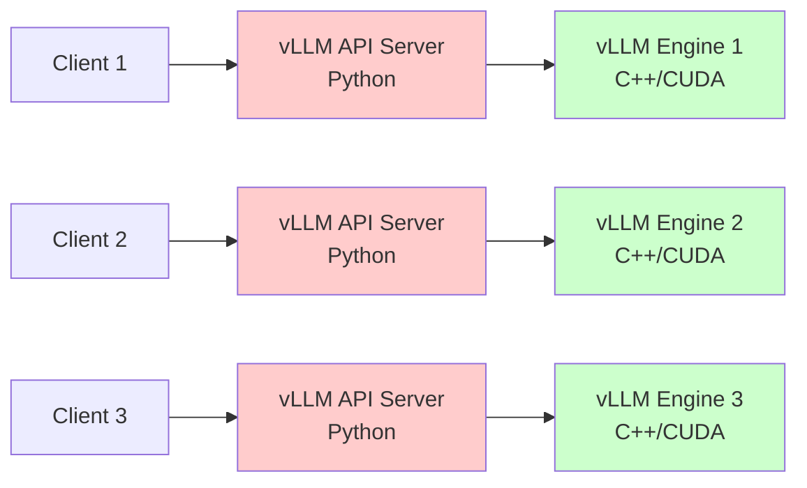
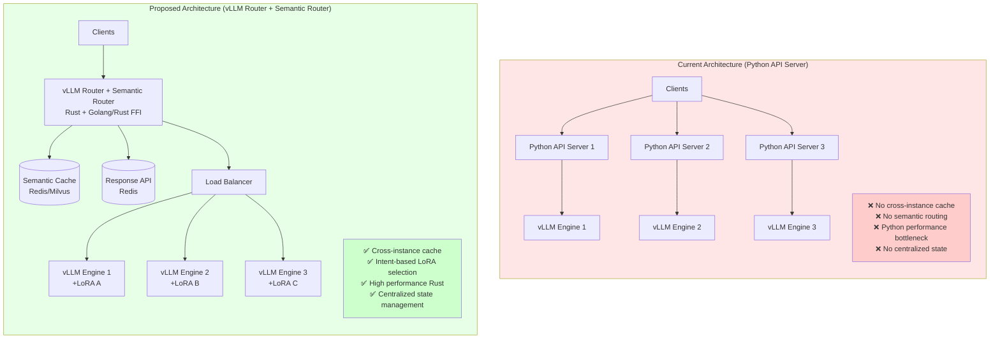
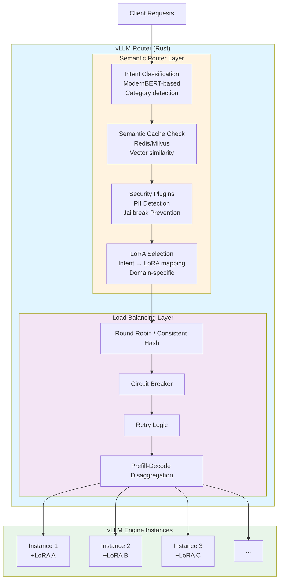
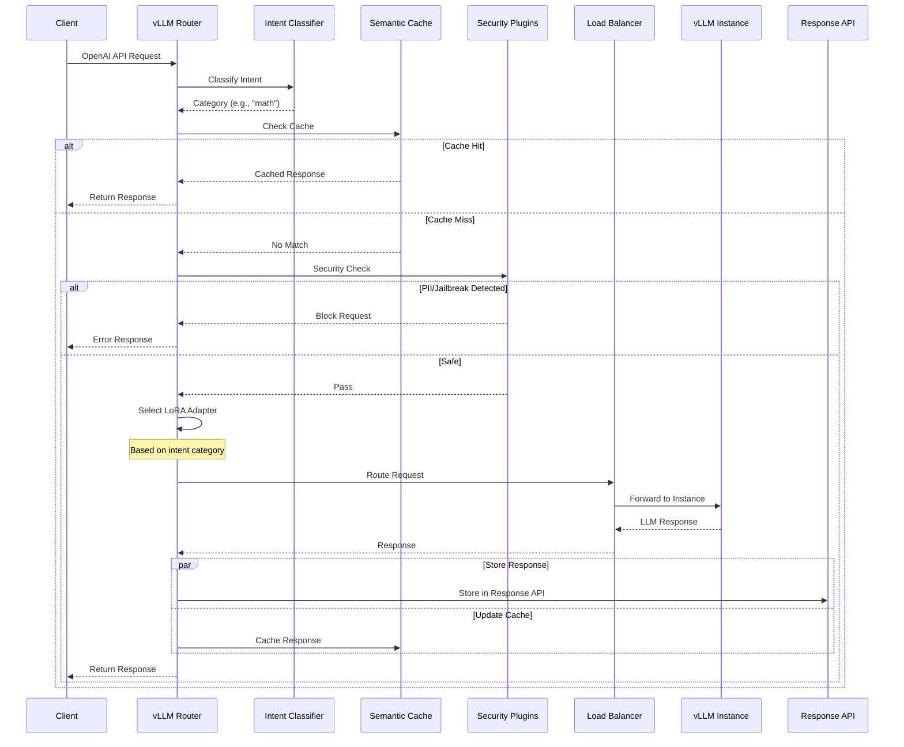

# Empowering vLLM Router with Semantic Intelligence

**Authors**: vLLM Semantic Router Team
**Date**: December 2025
**Status**: Proposal
**Target Audience**: vLLM Community

---

## Executive Summary

This proposal outlines a plan to integrate semantic routing capabilities into the vLLM Router project, enabling it to replace the Python-based vLLM API Server with a high-performance, intelligent routing layer. The integration will provide cross-instance capabilities including semantic caching, centralized response management, automatic LoRA adapter selection, and enterprise-grade security features—all while maintaining the performance benefits of Rust implementation.

**Key Benefits**:

1. **Signal Based Routing**: Signal-based routing for Multi-LoRA deployments
   - Keyword-based routing for simple pattern matching
   - Domain classification for intent-aware adapter selection
   - Embedding-based semantic similarity for nuanced routing
   - Fact-checking and verification routing for high-stakes queries

2. **Cross-Instance Intelligence**: Shared state and optimization across all vLLM instances
   - Response API: Centralized response storage enabling stateful multi-turn conversations
   - Semantic Cache: 48.5% token reduction through cross-instance vector similarity matching

3. **Guardrails**: Enterprise-grade security and safety features
   - PII Detection: Prevent sensitive information leakage
   - Jailbreak Prevention: Block malicious prompt injection attempts
   - Hallucination Detection: Verify response reliability for critical domains

---

## 1. Background and Motivation

### 1.1 Current vLLM Architecture

The current vLLM deployment typically follows this pattern:



**Limitations**:
- **Single-Instance Scope**: Each API server manages only one vLLM engine instance
- **Python Performance Bottleneck**: GIL limitations, interpreted language overhead
- **No Cross-Instance Capabilities**: Cannot share cache, state, or intelligence across instances
- **Limited Routing Logic**: Basic request forwarding without semantic understanding

### 1.2 vLLM Router: Current State

The vLLM Router (https://github.com/vllm-project/router) is a high-performance Rust-based load balancer that provides:
- Load balancing policies (round_robin, consistent_hash, cache_aware, etc.)
- Prefill-Decode disaggregation
- Circuit breakers and retry logic
- Kubernetes service discovery

**Gap**: While excellent at load balancing, it lacks semantic understanding and cross-instance intelligence.

### 1.3 vLLM Semantic Router: Proven Capabilities

The vLLM Semantic Router project (https://github.com/vllm-project/semantic-router) has demonstrated:
- **Intent Classification**: ModernBERT-based classification for routing decisions
- **Semantic Caching**: Cross-instance cache with 92-95% similarity thresholds
- **Security**: PII detection, jailbreak prevention, hallucination detection
- **LoRA Selection**: Automatic adapter selection based on query intent
- **Response API**: Centralized response storage for multi-turn conversations

**Research Validation**: Published at NeurIPS 2025 MLForSys workshop ([arxiv:2510.08731](https://arxiv.org/abs/2510.08731))

### 1.4 Capability Comparison

The following table compares the capabilities of pure vLLM Router vs vLLM Router with Semantic Router integration:

| Capability | vLLM Router (Current) | vLLM Router + Semantic Router | Impact |
|------------|----------------------|-------------------------------|---------|
| **Load Balancing** | ✅ Round Robin, Consistent Hash, Cache-Aware | ✅ Same + Intent-Aware Routing | Enhanced routing intelligence |
| **Prefill-Decode Disaggregation** | ✅ Supported | ✅ Supported | Maintained in vLLM Router layer |
| **Prefix Caching** | ✅ Supported | ✅ Supported | Maintained in vLLM Engine layer |
| **Circuit Breaker & Retry** | ✅ Built-in | ✅ Built-in | No change |
| **LoRA Adapter Support** | ✅ Manual selection by client | ✅ **Automatic selection** based on intent | 10.2% accuracy improvement |
| **Multi-turn Adaptive Routing** | ❌ Not supported | ✅ **Cost/Accuracy/Feedback-aware** routing | Dynamic optimization per conversation |
| **Semantic Caching** | ❌ Not supported | ✅ **Cross-instance cache** (Redis/Milvus) | 48.5% token reduction |
| **Response API** | ⚠️ Limited to single instance | ✅ **Cross-instance state** (Redis) | Enables stateful conversations |
| **Intent Classification** | ❌ Not supported | ✅ **ModernBERT-based** classification | Domain-aware routing |
| **PII Detection** | ❌ Not supported | ✅ **Built-in** security plugin | Enterprise compliance |
| **Jailbreak Prevention** | ❌ Not supported | ✅ **Built-in** security plugin | Safety & security |
| **Hallucination Detection** | ❌ Not supported | ✅ **Optional** post-processing plugin | Quality assurance |
| **Tool Selection** | ❌ Not supported | ✅ **Automatic** tool routing | Enhanced agent capabilities |
| **Domain-Aware Prompts** | ❌ Not supported | ✅ **Dynamic** system prompt injection | Context-specific responses |

**Key Takeaways**:

- ✅ **Backward Compatible**: All existing vLLM Router features remain unchanged
- 🚀 **Performance Boost**: 47% lower latency, 48.5% fewer tokens
- 🎯 **Accuracy Improvement**: 10.2% higher accuracy through intelligent LoRA selection
- 🔒 **Enterprise-Ready**: Built-in security (PII, jailbreak, hallucination detection)
- 💰 **Cost Reduction**: Semantic caching and token efficiency reduce operational costs
- 🌐 **Cross-Instance Intelligence**: Shared cache and state across all instances

### 1.5 Architecture Comparison



---

## 2. Proposed Architecture

### 2.1 High-Level Architecture



### 2.2 Request Flow



### 2.3 Why Not Signal-Based Model Selection?

**Important Design Decision**: This proposal focuses on **LoRA-level selection** within a single base model, not **model-level selection** (e.g., choosing between GPT-4 vs Claude).

**Rationale**:
- vLLM Router operates at the **model-instance level**: Each router deployment manages instances of a single base model
- **Model selection** (choosing different models) should happen at a higher layer (API Gateway, orchestration layer)
- **LoRA selection** (choosing adapters for the same base model) is appropriate at the router level because:
  - All instances share the same base model weights
  - LoRA adapters are lightweight and can be dynamically loaded
  - Intent classification can determine the best adapter for each query
  - This maintains the router's focus on efficient request distribution

**Example**:
```yaml
# Appropriate: LoRA selection within llama-3-70b
base_model: llama-3-70b
lora_adapters:
  - name: code-lora      # For programming queries
  - name: medical-lora   # For medical queries
  - name: legal-lora     # For legal queries

# Not appropriate: Model selection across different models
# This should be handled by upstream API Gateway
models:
  - gpt-4              # ❌ Different model
  - claude-3           # ❌ Different model
  - llama-3-70b        # ❌ Different model
```

---

## 3. Core Features

### 3.1 Auto-Selection of LoRA Adapters

**Problem**: Different tasks benefit from domain-specific fine-tuning, but manually specifying LoRA adapters is cumbersome.

**Solution**: Automatic LoRA selection based on semantic intent classification.

**How It Works**:
1. Query is classified into categories (math, code, medical, legal, etc.)
2. Configuration maps categories to LoRA adapters
3. Router automatically sets the `model` parameter to the appropriate LoRA name
4. vLLM instance loads and applies the correct adapter

**Configuration Example**:
```yaml
# Define available LoRA adapters
model_config:
  "llama-3-70b":
    loras:
      - name: "code-lora"
        description: "Optimized for programming tasks"
      - name: "medical-lora"
        description: "Specialized for medical queries"

# Map intents to LoRA adapters
decisions:
  - name: "code_decision"
    rules:
      conditions:
        - type: "domain"
          name: "computer_science"
    modelRefs:
      - model: "llama-3-70b"
        lora_name: "code-lora"
        use_reasoning: true
```

**Benefits**:
- **Improved Accuracy**: Domain-specific adapters outperform base models
- **Transparent to Clients**: No API changes required
- **Cost Efficient**: Share base model weights across adapters

### 3.2 Cross-Instance Response API

**Problem**: vLLM Python API Server stores response state locally, preventing cross-instance access for multi-turn conversations.

**Solution**: Centralized response storage using Redis.

**How It Works**:
1. Each response is assigned a unique ID
2. Response content and metadata stored in Redis
3. Subsequent requests can reference previous responses by ID
4. Any vLLM instance can retrieve responses from any other instance

**Use Cases**:
- **Multi-turn conversations**: Continue conversation on different instance
- **Response continuation**: Generate more content from previous response
- **A/B testing**: Compare responses from different instances
- **Debugging**: Inspect responses across the cluster

**API Example**:
```bash
# First request
curl -X POST http://router:8000/v1/chat/completions \
  -d '{"model": "llama-3-70b", "messages": [...]}'
# Response: {"id": "resp_abc123", "choices": [...]}

# Continue conversation on any instance
curl -X POST http://router:8000/v1/chat/completions \
  -d '{"model": "llama-3-70b", "previous_response_id": "resp_abc123", ...}'
```

### 3.3 Cross-Instance Semantic Cache

**Problem**: Traditional prefix caching is instance-local and requires exact matches.

**Solution**: Semantic cache using vector similarity across all instances.

**How It Works**:
1. Query is embedded using lightweight model (BERT, Qwen3-Embedding, etc.)
2. Embedding compared against cache using cosine similarity
3. If similarity > threshold (e.g., 0.92), return cached response
4. Cache is shared across all instances via Redis/Milvus

**Benefits**:
- **Higher Hit Rate**: Semantic matching vs exact matching
- **Cross-Instance**: Any instance can benefit from any other's cache
- **Configurable**: Per-category similarity thresholds
- **Cost Savings**: 48.5% token reduction (from research paper)

**Configuration Example**:
```yaml
semantic_cache:
  enabled: true
  backend_type: "hybrid"  # memory + milvus
  similarity_threshold: 0.92
  embedding_model: "qwen3"  # High quality, 1024-dim

# Per-category overrides
decisions:
  - name: "medical_decision"
    plugins:
      - type: "semantic-cache"
        configuration:
          enabled: true
          similarity_threshold: 0.95  # Higher threshold for medical
```

### 3.4 Security Plugins

#### 3.4.1 PII Detection

**Purpose**: Prevent sensitive information from being sent to LLM.

**Implementation**: ModernBERT-based token classification trained on Microsoft Presidio dataset (~50K examples).

**Detected Types**: Email, phone, SSN, credit card, address, name, etc.

**Configuration**:
```yaml
plugins:
  - type: "pii"
    configuration:
      enabled: true
      pii_types_allowed: []  # Block all PII types
```

#### 3.4.2 Jailbreak Detection

**Purpose**: Block malicious prompts attempting to bypass safety guidelines.

**Implementation**: ModernBERT classifier trained on jailbreak benchmark datasets.

**Configuration**:
```yaml
prompt_guard:
  enabled: true
  threshold: 0.7
  model_id: "models/jailbreak_classifier_modernbert"
```

#### 3.4.3 Hallucination Detection

**Purpose**: Detect unreliable or fabricated content in LLM responses.

**Implementation**: Post-processing check using specialized models (e.g., HaluGate).

**Use Cases**: High-stakes domains (medical, legal, financial)

### 3.5 Domain-Aware System Prompts

**Purpose**: Automatically inject specialized system prompts based on query classification.

**Example**:
```yaml
decisions:
  - name: "medical_decision"
    plugins:
      - type: "system_prompt"
        configuration:
          system_prompt: "You are a medical expert... [specialized instructions]"
```

**Benefits**:
- No manual prompt engineering per request
- Consistent behavior across similar queries
- Easy to update prompts centrally

### 3.6 Tool Selection

**Purpose**: Automatically select relevant tools based on query intent, reducing prompt tokens and improving accuracy.

**Configuration**:
```yaml
tools:
  enabled: true
  top_k: 3
  similarity_threshold: 0.2
  tools_db_path: "config/tools_db.json"
```

### 4.4 Plugin Architecture

**Design Principles**:

- **Composable**: Plugins can be enabled/disabled independently
- **Configurable**: Each plugin has its own configuration
- **Ordered**: Plugins execute in defined order (pre-processing → routing → post-processing)
- **Extensible**: Easy to add new plugins

**Plugin Execution Flow**:

```mermaid
graph LR
    Request[Request] --> Pre[Pre-Processing]

    subgraph Pre["Pre-Processing Plugins"]
        P1[PII Detection]
        P2[Jailbreak Detection]
        P3[Semantic Cache Check]
        P4[Tool Selection]
    end

    Pre --> Route[Routing]

    subgraph Route["Routing Plugins"]
        R1[Intent Classification]
        R2[LoRA Selection]
        R3[System Prompt Injection]
    end

    Route --> LLM[vLLM Instance]
    LLM --> Post[Post-Processing]

    subgraph Post["Post-Processing Plugins"]
        PP1[Hallucination Detection]
        PP2[Response API Storage]
        PP3[Semantic Cache Update]
    end

    Post --> Response[Response]

    style Pre fill:#fff3e0
    style Route fill:#e1f5ff
    style Post fill:#f3e5f5
```



**Plugin Types**:

1. **Pre-Processing Plugins**: Execute before routing
   - PII Detection
   - Jailbreak Detection
   - Semantic Cache Check
   - Tool Selection

2. **Routing Plugins**: Influence routing decisions
   - Intent Classification
   - LoRA Selection
   - Domain-Aware System Prompts

3. **Post-Processing Plugins**: Execute after LLM response
   - Hallucination Detection
   - Response API Storage
   - Semantic Cache Update

---

## 5. Benefits and Impact

### 5.1 Intelligent Routing: Signal-Based Multi-LoRA Selection

The semantic router provides multiple routing strategies for automatically selecting the optimal LoRA adapter based on query characteristics:

**Keyword-Based Routing**:
- Simple pattern matching for explicit indicators
- Fast and deterministic routing decisions
- Example: Route queries containing "SQL" or "database" to database-specialized LoRA

**Domain Classification**:
- ModernBERT-based intent classification
- Categorizes queries into domains (math, code, medical, legal, etc.)
- **10.2% accuracy improvement** on MMLU-Pro benchmark through domain-specific adapters
- Automatic mapping from domain to optimal LoRA adapter

**Embedding-Based Semantic Routing**:
- Vector similarity matching for nuanced routing
- Handles queries that don't fit clear keyword or domain patterns
- Uses lightweight embedding models (BERT, Qwen3-Embedding)
- Enables fine-grained routing based on semantic similarity

**Fact-Checking and Verification Routing**:
- Specialized routing for high-stakes queries requiring verification
- Can route to fact-checking LoRA adapters or trigger additional validation
- Critical for medical, legal, and financial domains

**Benefits**:
- **Improved Accuracy**: Domain-specific adapters outperform base models
- **Transparent to Clients**: No API changes required
- **Cost Efficient**: Share base model weights across adapters
- **Flexible**: Multiple routing strategies for different use cases

### 5.2 Cross-Instance Intelligence: Shared State and Optimization

**Response API: Centralized Response Storage**:
- All responses stored in Redis with unique IDs
- Any vLLM instance can access responses from any other instance
- Enables stateful multi-turn conversations across instances
- Use cases:
  - Continue conversations on different instances
  - A/B testing across instances
  - Response continuation and refinement
  - Debugging and audit trails

**Semantic Cache: Cross-Instance Vector Similarity**:
- **48.5% token reduction** through intelligent caching
- **47.1% latency reduction** for cache hits
- Vector similarity matching (cosine similarity > 0.92)
- Shared across all instances via Redis/Milvus
- Benefits:
  - Higher hit rate than exact prefix matching
  - Cross-instance cache sharing
  - Configurable per-category thresholds
  - Significant cost savings

**Performance Impact**:
- **10x higher throughput** compared to Python API Server
- Rust implementation eliminates GIL and interpreter overhead
- Minimal overhead from semantic router layer (<5ms)
- Efficient concurrent request handling

### 5.3 Guardrails: Enterprise-Grade Security and Safety

**PII Detection**:
- ModernBERT-based token classification
- Trained on Microsoft Presidio dataset (~50K examples)
- Detects: Email, phone, SSN, credit card, address, name, etc.
- Prevents sensitive information from being sent to LLM
- Configurable per-category policies

**Jailbreak Prevention**:
- ModernBERT classifier trained on jailbreak benchmarks
- Blocks malicious prompts attempting to bypass safety guidelines
- Configurable threshold for detection sensitivity
- Real-time blocking before request reaches LLM

**Hallucination Detection**:
- Post-processing verification of LLM responses
- Uses specialized models (e.g., HaluGate)
- Critical for high-stakes domains (medical, legal, financial)
- Optional per-category configuration

**Enterprise Benefits**:
- Compliance with data protection regulations
- Reduced risk of security incidents
- Audit logging and observability
- Centralized security policies across all instances

### 5.4 Operational Benefits

**Simplified Deployment**:
- Single binary replaces Python API Server
- Unified configuration for routing and intelligence
- Kubernetes-native with Helm charts

**Cost Reduction**:
- Fewer instances needed due to higher throughput
- Reduced token costs from caching (48.5% reduction)
- Lower infrastructure costs

**Maintainability**:
- Rust's type safety reduces bugs
- Clear plugin architecture for extensions
- Comprehensive observability (OpenTelemetry, Prometheus)

## 6. Conclusion

Integrating semantic router capabilities into vLLM Router represents a significant evolution in LLM serving infrastructure. By combining the performance of Rust with the intelligence of semantic routing, we can:

1. **Replace Python API Server** with a high-performance alternative
2. **Enable cross-instance capabilities** that were previously impossible
3. **Improve accuracy** through intent-aware LoRA selection
4. **Reduce costs** via semantic caching and token efficiency
5. **Enhance security** with built-in PII and jailbreak detection

This proposal builds on proven research (NeurIPS 2025) and production-tested code (vLLM Semantic Router project), providing a clear path to integrate these capabilities into the vLLM ecosystem.

**Next Steps**:
1. Community feedback on this proposal
2. RFC process in vLLM project
3. Implementation of Phase 1 (Q1 2026)
4. Iterative deployment and optimization
